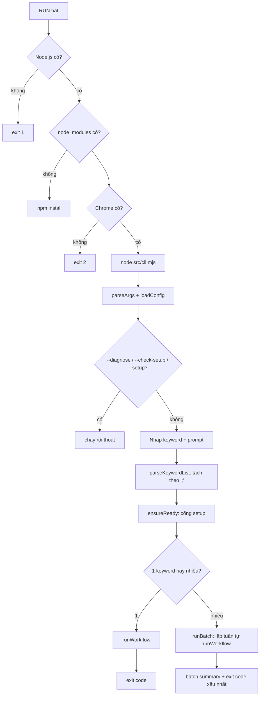
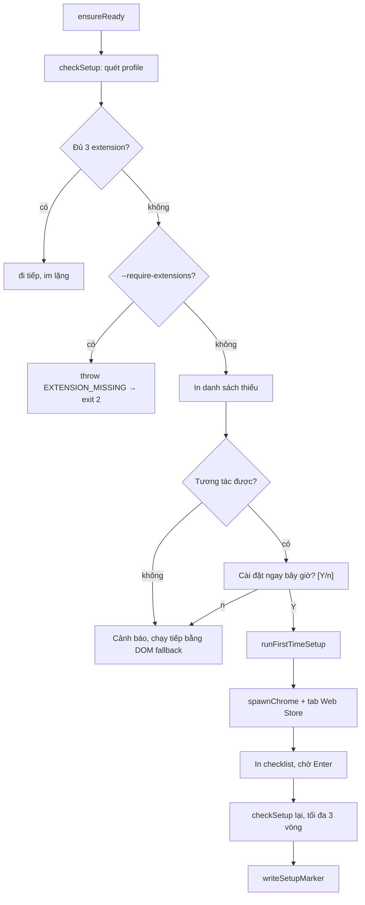
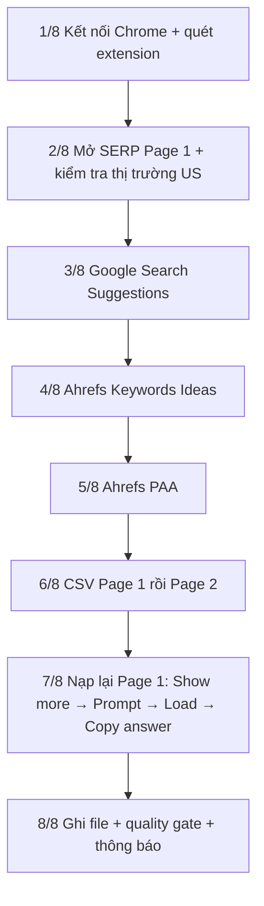
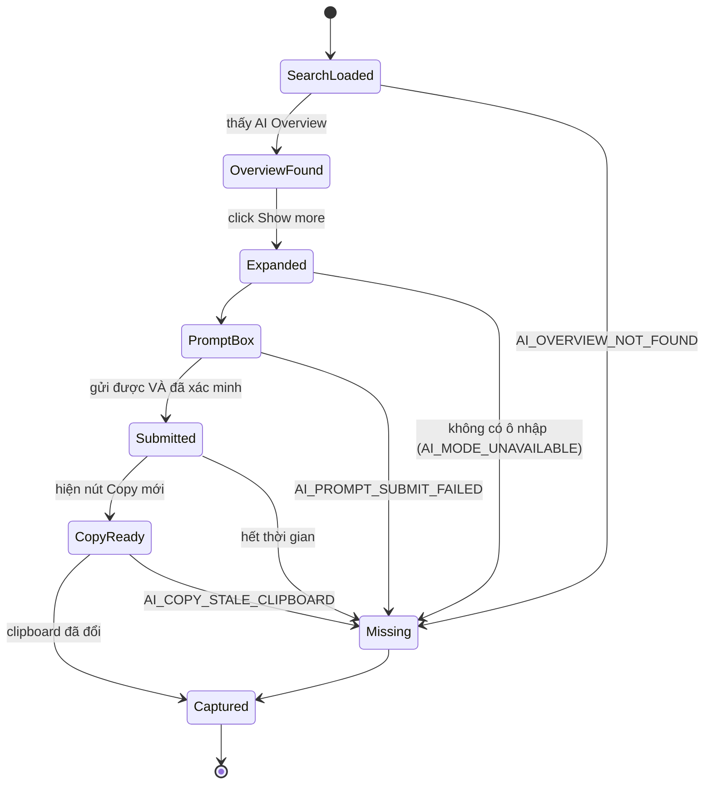
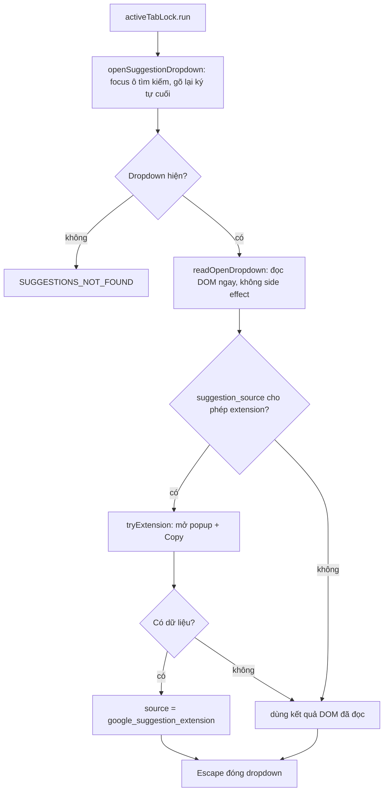
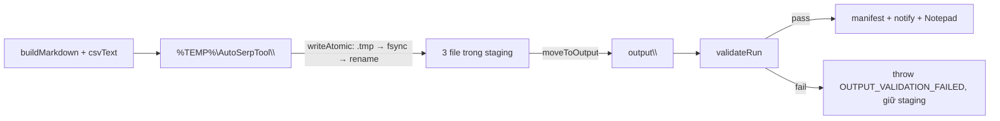

# Đặc tả hiện trạng — Auto SERP Research Collector

> **Tài liệu này mô tả code ĐANG CHẠY**, không phải yêu cầu ban đầu.
> Mục đích: để sửa lỗi và nâng cấp mà không phải đọc lại toàn bộ source.
> Đặc tả yêu cầu gốc nằm ở `DAC_TA_TOOL_AUTO_SERP_GOOGLE_BAT.md`; mục 14 dưới đây liệt kê
> những chỗ hiện trạng **khác** với yêu cầu gốc và lý do.

- Phiên bản tài liệu: 1.0 — dựng từ source ngày 2026-08-21
- Node 20+ / Windows 10-11 / Google Chrome Stable
- Test: **264 test, pass 264** (`npm test`, ~190s)

---

## Mục lục

1. [Bản đồ file](#1-bản-đồ-file)
2. [Luồng chạy tổng thể](#2-luồng-chạy-tổng-thể)
3. [Launcher và CLI](#3-launcher-và-cli)
4. [Cổng setup](#4-cổng-setup)
5. [Tầng browser](#5-tầng-browser)
6. [Orchestrator: hai chế độ chạy](#6-orchestrator-hai-chế-độ-chạy)
7. [Adapter: hợp đồng dữ liệu](#7-adapter-hợp-đồng-dữ-liệu)
8. [Extractor: hàm thuần hai môi trường](#8-extractor-hàm-thuần-hai-môi-trường)
9. [Selector registry](#9-selector-registry)
10. [Tầng output và quality gate](#10-tầng-output-và-quality-gate)
11. [Config đầy đủ](#11-config-đầy-đủ)
12. [Mã lỗi, cảnh báo, exit code](#12-mã-lỗi-cảnh-báo-exit-code)
13. [Bản đồ test](#13-bản-đồ-test)
14. [Khác biệt so với đặc tả gốc](#14-khác-biệt-so-với-đặc-tả-gốc)
15. [Bất biến không được phá](#15-bất-biến-không-được-phá)
16. [Điểm mở rộng khi nâng cấp](#16-điểm-mở-rộng-khi-nâng-cấp)
17. [Triệu chứng → sửa ở đâu](#17-triệu-chứng--sửa-ở-đâu)
18. [Nợ kỹ thuật và phần chưa kiểm chứng](#18-nợ-kỹ-thuật-và-phần-chưa-kiểm-chứng)

---

## 1. Bản đồ file

```text
SERP Extractor\
├── RUN.bat            ← LAUNCHER DUY NHẤT (setup + run gộp chung)
├── OPEN_CHROME.bat    ← mở sẵn cửa sổ Chrome automation để các run sau attach vào
├── SETUP.bat          ← lối tắt `--setup` (không bắt buộc)
├── DIAGNOSE.bat       ← lối tắt `--diagnose`
├── SMOKE_TEST.bat     ← chạy src/smoke.mjs
├── TEST.bat           ← npm test
├── config\
│   ├── default.yaml   ← toàn bộ tham số runtime
│   ├── local.yaml     ← (tùy chọn, không có sẵn) merge đè lên default
│   └── selectors.yaml ← selector registry, versioned theo block
├── src\
│   ├── cli.mjs           ← parse argv, batch nhiều keyword, diagnose, exit code
│   ├── setup.mjs         ← cổng kiểm tra/cài đặt lần đầu
│   ├── orchestrator.mjs  ← state machine cấp run, workflow tuần tự cố định
│   ├── smoke.mjs         ← smoke test định kỳ, ghi ra thư mục tạm
│   ├── browser\   chrome-launcher · cdp-connector · extension-discovery · locator · page-eval
│   ├── adapters\  google-search · ai-mode · ahrefs-widget · paa · suggestions · serp-export
│   ├── extractors\ dom-to-markdown · native-serp · paa-dom · suggestions-dom · ahrefs-dom · csv-normalizer
│   ├── output\    markdown-builder · artifact-writer · validator · manifest · notifier
│   └── core\      config · errors · logger · retry · sanitize · text · state-machine · mutex · input · prompt
├── tests\  unit\ (13 file) · integration\ (10 file) · fixtures\ (13 file HTML) · helpers\
├── output\  ← chỉ chứa thư mục kết quả
└── logs\    ← log, screenshot, manifest, batch summary
```

Quy tắc phân tầng, giữ nguyên khi sửa:

| Tầng | Được phép làm gì | KHÔNG được làm gì |
| --- | --- | --- |
| `.bat` | Kiểm tra Node/Chrome, gọi `node src/cli.mjs`, in exit code | Chứa logic nghiệp vụ |
| `cli.mjs` | Parse input, vòng lặp batch, exit code | Điều khiển trình duyệt |
| `orchestrator.mjs` | Điều phối step, retry, pause/resume | Biết selector cụ thể |
| `adapters/` | Biết selector, thao tác trang, trả dữ liệu chuẩn hóa | Ghi file, quyết định exit code |
| `extractors/` | Đọc DOM thuần, không side effect | Dùng import, dùng Playwright API |
| `output/` | Ghi file, validate, thông báo | Biết trình duyệt |
| `core/` | Tiện ích không phụ thuộc domain | Biết Google/Chrome |

---

## 2. Luồng chạy tổng thể



**Một lần `runWorkflow` = một keyword = một thư mục kết quả.** Nhiều keyword chạy tuần tự,
không song song (`performance.keyword_concurrency: 1`, cố định).

---

## 3. Launcher và CLI

### 3.1 RUN.bat làm gì

1. Phát hiện double-click qua `%cmdcmdline%` → nếu có thì `pause` ở cuối để cửa sổ không đóng.
2. `where node` → thiếu thì exit 1 kèm hướng dẫn.
3. Thiếu `node_modules\playwright-core` → `npm install` tự động.
4. Dò `chrome.exe` ở 3 vị trí chuẩn → thiếu thì exit 2.
5. `node "src\cli.mjs" %*` — truyền nguyên tham số.
6. Dịch exit code thành câu tiếng Việt.

**Mọi file `.bat` phải là CRLF.** Sau khi sửa `.bat`, chạy lại:

```bash
node -e "const fs=require('fs');for(const f of fs.readdirSync('.').filter(n=>n.toLowerCase().endsWith('.bat')))fs.writeFileSync(f,fs.readFileSync(f,'utf8').replace(/\r\n/g,'\n').replace(/\n/g,'\r\n'),'utf8')"
```

### 3.2 Tham số CLI

| Cờ | Ý nghĩa | Đọc ở |
| --- | --- | --- |
| `<keyword>` | Vị trí 1. Nhiều keyword ngăn bằng `;` | `parseKeywordList` |
| `<ai prompt>` | Vị trí 2. Nhiều prompt ngăn bằng `;` | `parsePromptList` |
| `--config <file>` | File config thay thế | `loadConfig` |
| `--overwrite` | Cho ghi đè output (có backup) | `resolveOutputDir` |
| `--sequential` / `--parallel` | Tương thích lệnh cũ; không đổi workflow cố định | parser CLI |
| `--no-open` | Không mở Notepad | `openInEditor` |
| `--setup` | Chạy riêng cài đặt rồi thoát | `runFirstTimeSetup` |
| `--skip-setup` | Bỏ qua cổng setup | `ensureReady` |
| `--require-extensions` | Thiếu extension thì dừng hẳn | `ensureReady` |
| `--keep-staging` | Giữ staging để debug | `cleanStaging` |
| `--verbose` | Log mức debug | `RunLogger` |
| `--no-interactive` | Không hỏi, không pause | `isInteractive` |
| `--diagnose` | Kiểm tra môi trường rồi thoát | `diagnose()` |
| `--check-setup` | Kiểm tra 3 extension rồi thoát | `reportSetup()` |

### 3.3 Ghép keyword ↔ prompt

`pairKeywordsAndPrompts(keywords, prompts, fallback)` trong `src/core/input.mjs`:

| Số prompt | Hành vi | `promptSource` |
| --- | --- | --- |
| 0 | Template config cho từng keyword | `template` |
| 1 | Dùng chung | `shared` |
| n ≥ 2 | Khớp theo chỉ số | `explicit` |
| Thiếu so với keyword | Keyword thừa dùng template | `template` |

Keyword được trim, collapse khoảng trắng, **dedupe không phân biệt hoa/thường**.

### 3.4 Batch

`runBatch()` chạy tuần tự, **một keyword lỗi không dừng hàng đợi**. Kết thúc ghi:

```text
logs\batch-<yyyymmdd-hhmmss>\
├── batch-summary.json
└── batch-summary-tong-ket.txt   ← file này được mở bằng Notepad
```

Exit code của batch = exit code của **keyword lỗi đầu tiên**, hoặc 0 nếu tất cả thành công.

---

## 4. Cổng setup

`src/setup.mjs` — chạy **trước** `runWorkflow`, sau khi đã có keyword.



- `checkSetup(config)` → `{complete, missing[], installed[], extensions}`
- Marker: `<user_data_dir>\auto-serp-setup.json` — **chỉ để tham khảo**, code không đọc lại nó.
  Nguồn sự thật luôn là quét thư mục `Extensions`.
- Người dùng gõ `bo qua` / `skip` / `s` / `n` → thoát vòng cài đặt, chạy tiếp.

---

## 5. Tầng browser

### 5.1 chrome-launcher.mjs

| Hàm | Vai trò |
| --- | --- |
| `findChrome(configured, env)` | Thứ tự: config → `CHROME_PATH` → 3 đường dẫn chuẩn → registry `App Paths` |
| `assertNotDefaultProfile(dir)` | **Chặn cứng** nếu `user_data_dir` trỏ vào profile Chrome mặc định |
| `probeDebugger(port)` | `GET http://127.0.0.1:<port>/json/version`, timeout 1.5s |
| `spawnChrome(path, opts)` | Spawn detached, nhận `urls[]` để mở sẵn tab |
| `ensureChrome(config, logger, opts)` | **Port đã mở → attach (`launched:false`)**, chưa mở → spawn rồi poll |

Cờ Chrome đang dùng — không thêm cờ stealth:

```text
--remote-debugging-port=<port>
--user-data-dir=<user_data_dir>
--no-first-run
--no-default-browser-check
--window-size=<w>,<h>
[--headless=new]        khi browser.headless = true
[<url> ...]             khi truyền opts.urls
```

### 5.2 cdp-connector.mjs

| Hàm | Ghi chú |
| --- | --- |
| `connectCdp({port})` | `chromium.connectOverCDP('http://127.0.0.1:<port>')` |
| `primaryContext(browser)` | `browser.contexts()[0]` |
| `acquirePage(context)` | Tái dùng tab `about:blank`, không có thì mở tab mới |
| `readAttachedProfilePath(context)` | Mở `chrome://version/`, đọc `#profile_path` |
| `verifyAttachedProfile(context, expectedDir)` | **So `dirname(profile_path)` với `user_data_dir`; lệch → throw `PROFILE_MISMATCH`** |
| `disconnect(browser)` | `browser.close()` chỉ ngắt CDP, **không đóng Chrome của người dùng** |

`verifyAttachedProfile` chạy mỗi run khi `browser.verify_profile !== false`. Đây là chốt chặn để
tool không bao giờ làm việc nhầm trên profile cá nhân khi cổng debug bị chiếm.

### 5.3 extension-discovery.mjs

Quét `<user_data_dir>\<Default|Profile N>\Extensions\<id>\<version>\manifest.json`:

- `listProfileDirs()` — nhận `Default` và `Profile N`, **ưu tiên `Default` trước**.
- `discoverExtension()` — duyệt hết các profile, chọn **version cao nhất** bằng so sánh theo từng số
  (`1.10.0` > `1.9.0`), đọc `action.default_popup` (MV3) hoặc `browser_action.default_popup` (MV2).
- `findInPersonalChrome(ids, env)` — **chỉ kiểm tra sự tồn tại của thư mục** trong Chrome cá nhân để
  cảnh báo "cài nhầm profile". Không đọc manifest, cookie, lịch sử. Tắt bằng `privacy.hint_personal_chrome`.

Kết quả mỗi extension:

```js
{ installed, id, name, version, manifestVersion, dir, profileDir,
  popupPath, popupUrl, optionsUrl, serviceWorker, configuredName, webstore, reason?, searchedProfiles? }
```

### 5.4 locator.mjs — selector registry runtime

`firstVisible(scope, specs, opts)` duyệt danh sách spec theo thứ tự, trả về spec **đầu tiên nhìn thấy được**:

```js
{ locator, spec, index }   // index > 0 nghĩa là đã phải dùng fallback
```

Khi `index > 0` và có `opts.logger` + `opts.block` → ghi cảnh báo `SELECTOR_DRIFT`. **Đây là tín hiệu
chính để biết Google/extension đã đổi UI.**

Kiểu spec hỗ trợ:

| `type` | Dịch thành |
| --- | --- |
| `role` | `scope.getByRole(role, {name: RegExp})` |
| `text` | `scope.getByText(RegExp)` |
| `css` | `scope.locator(css)` |
| `text_container` | `getByText(...).first().locator('xpath=../..')` — leo `up` cấp |

Cú pháp `(?i)...` trong YAML được `toRegExp()` dịch thành `new RegExp(body, 'i')`.

### 5.5 page-eval.mjs — cầu nối extractor ↔ trang

```js
composeExtractor(fn, call = '__f(arg)')
// → new Function('arg', `const __f = ${fn.toString()};\nreturn ${call};`)
runExtractor(page, fn, arg, call)                   // page.evaluate
runExtractorOnLocator(locator, fn, options, call)   // truyền element handle
```

Lý do tồn tại: `page.evaluate` chỉ serialize được hàm **self-contained**, không kéo theo `import`.
Nhờ cách ghép source này, **cùng một hàm** chạy được trong Chrome thật và trong linkedom khi test.

---

## 6. Orchestrator: workflow tuần tự cố định

Workflow luôn có 8 step. Các cờ `--parallel` / `--sequential` vẫn được parser nhận để tương thích
với shortcut hoặc script cũ, nhưng không thay đổi thứ tự chạy.



Thứ tự trên là contract của workflow. Nó tránh tranh chấp tab active và clipboard giữa Ahrefs/AI,
đồng thời bảo đảm hai CSV hoàn tất trước khi AI Overview thay đổi DOM. `pauseLock` vẫn bảo vệ hộp
thoại thao tác tay khi gặp CAPTCHA hoặc login.

### 6.1 Đánh số Page 2

Google thường bỏ qua `num=10` và trả nhiều hơn 10 kết quả ở Page 1.

```js
nextPagePositionOffset(page1Rows, resultsPerPage) = max(resultsPerPage, page1Rows)
```

- **URL luôn dùng `start=<results_per_page>`** và được `verifySerpUrl` kiểm tra lại.
- Chỉ **vị trí trong CSV** mới dịch theo số dòng thật của Page 1.
- Page 2 được trích xuất sau Page 1 nên dùng ngay offset đã tính từ số dòng thật của Page 1.
- Page 1 nhiều hơn `num` → cảnh báo `SERP_MORE_RESULTS_THAN_EXPECTED`.

### 6.2 Retry và pause

`runStep(state, name, fn)` bọc `withRetry`:

- `recovery.retries_per_step` (mặc định 2), backoff `[2000, 5000]`.
- Lỗi `ManualActionRequired` → `handleManualPause()` → chờ Enter → chạy lại step.
- Không retry: `MANUAL_CAPTCHA_REQUIRED`, `MANUAL_LOGIN_REQUIRED`, `CHROME_NOT_FOUND`,
  `INVALID_INPUT`, `INVALID_CONFIG`, `OUTPUT_CONFLICT` (xem `isRetryable`).
- Mỗi lần lỗi chụp screenshot vào `logs\<run_id>\screenshots\`.

### 6.5 Giá trị trả về của `runWorkflow`

```js
{
  status,        // 'SUCCESS' | 'COMPLETED_WITH_WARNINGS'
  outputDir, markdownPath, files[],
  counts,        // ai_chars, keyword_ideas, paa, suggestions, serp_page_1_rows, serp_page_2_rows
  sources,       // xem bảng mục 7.1
  warnings[],    // mã cảnh báo đã dedupe
  manifestPath, logDir, durationMs,
}
```

`status = SUCCESS` **chỉ khi không có cảnh báo nào**. Có cảnh báo → `COMPLETED_WITH_WARNINGS`,
exit code vẫn là 0.

---

## 7. Adapter: hợp đồng dữ liệu

### 7.1 Chuẩn trả về

Ba adapter danh sách (`ahrefs-widget`, `paa`, `suggestions`) trả cùng một shape:

```js
{ items: string[] | {question,answer}[], source: string, warnings: string[] }
```

`serp-export` trả `{ csvText, source, rowCount, warnings }`.
`ai-mode` trả `{ markdown, source, warnings, chars, states }` (`states` = lịch sử state machine).

Giá trị `source` hợp lệ — dùng trong manifest và trong smoke test để phát hiện phải dùng fallback:

| Khối | Nguồn ưu tiên | Fallback |
| --- | --- | --- |
| AI | `google_ai_overview` | `google_ai_mode`, `google_ai_mode_direct`, `none` |
| Keywords Ideas | `ahrefs_widget_dom` | `ahrefs_widget_clipboard`, `none` |
| PAA | `ahrefs_widget_dom` | `google_serp_dom`, `none` |
| Suggestions | `google_suggestion_extension` | `google_suggest_dom`, `google_autocomplete_endpoint`, `none` |
| SERP CSV | `seo_serp_extension` | `native_serp_dom` |

### 7.2 google-search.mjs

- `buildSearchUrl({scheme, domain, keyword, language, country, personalization, num, start, udm})`
  → `https://www.google.com/search?q=...&hl=en&gl=us&pws=0&num=10&start=0`
  (`scheme` chỉ đổi khi test cục bộ.)
- `detectPageState(page, selectors)` → `results | consent | captcha | login | unknown`
  Xét URL trước, rồi 4000 ký tự đầu của `body.innerText`, rồi `ready_markers`.
- `openSerp(page, url, ctx)` — điều hướng, xử lý consent, **CAPTCHA/login thì ném `ManualActionRequired`,
  tuyệt đối không tự vượt**.

### 7.3 ai-mode.mjs — state machine



Nội dung câu trả lời **lấy qua nút Copy + clipboard**, không đọc DOM. Lý do: khung trả lời
của Google trộn lẫn khối UI (Share, Good/Bad response, nguồn trích dẫn), còn nút Copy cho ra
đúng phần văn bản đã định dạng sẵn.

**Gửi prompt** (`sendPrompt`) — thử theo thứ tự, **mỗi lần đều phải xác minh**:

1. `Enter` ngay trên ô nhập (ô "Ask anything" của Google submit bằng Enter);
2. nút gửi tìm **trong khối prompt** — nới rộng dần `3 → container_up → 7` cấp cha tính từ ô nhập;
3. cuối cùng mới quét toàn trang — vẫn qua bộ lọc `control_exclude`.

**Xác minh đã gửi** (`verifySubmitted`): đặt một dấu mốc lên `window` trước khi bấm.
Dấu mốc biến mất → trang đã tải lại → `AI_PROMPT_SUBMIT_FAILED` **ngay**, không chờ hết
`ai.response_timeout_ms`. Còn lại coi là đã gửi khi: có `generating_markers`, có thêm block
`response_container`, có thêm nút Copy, URL sang dạng AI, hoặc ô nhập đã trống.
Sau `graceMs` (2.5s) mà prompt vẫn nằm nguyên trong ô → cách vừa thử không ăn → thử cách kế tiếp.

**Chọn nút Copy** (`waitForCopyButton`): ba ràng buộc cộng dồn — số lượng phải **nhiều hơn**
baseline đếm trước khi gửi; ứng viên không được nằm trong `control_exclude`; duyệt ngược từ
cuối cây DOM vì nút của câu trả lời mới sinh ra sau cùng.

**Nhận nội dung** (`CopyReady`): ghi sẵn một chuỗi đánh dấu vào clipboard rồi **đọc lại để
xác nhận cùng một clipboard**; ghi không được thì lấy nội dung đọc được làm mốc. Bấm Copy xong
poll tới `ai.clipboard_timeout_ms`; clipboard **không đổi** → `AI_COPY_STALE_CLIPBOARD` (nội dung
đang giữ là của bước trước, tuyệt đối không dùng). Nội dung trùng prompt hoặc ngắn hơn
`ai.min_response_chars` cũng bị từ chối.

`waitForStableResponse` và `trimTrailingUi` vẫn được xuất khẩu và có test riêng, nhưng
**không nằm trên luồng chính** nữa — chúng dành cho đường đọc DOM nếu sau này cần.

### 7.4 suggestions.mjs — thứ tự thao tác quan trọng

Đúng theo thao tác tay: **mở dropdown trước, rồi mới gọi extension**.



Đọc DOM **trước** khi mở popup vì mở popup ở tab khác sẽ làm dropdown đóng lại.

**Lọc gợi ý cá nhân**: dòng nào chứa nút điều khiển (`control_nodes`) hoặc kết thúc bằng
`control_words` (`Delete`/`Remove`/`Report`) là **lịch sử tìm kiếm của tài khoản**, không phải
Google Search Suggestion. Mặc định loại bỏ (`extractors.exclude_personalized_suggestions: true`),
ghi `SUGGESTIONS_PERSONALIZED` kèm danh sách đã bỏ. Nếu **toàn bộ** đều là lịch sử →
`SUGGESTIONS_PERSONALIZED_ONLY` và section ghi cảnh báo thay vì dữ liệu sai.

### 7.5 serp-export.mjs

Extension trước, native fallback bắt buộc. Bắt file tải về bằng **hai đường song song**:

1. `resultPage.waitForEvent('download')` của Playwright.
2. Theo dõi thư mục `Downloads` (`waitForNewCsv`): file `.csv` có `mtime` mới và **kích thước ổn định
   qua 2 lần poll**.

File gốc trong `Downloads` được **copy, không xóa** (tránh xóa nhầm file người dùng); đường dẫn ghi vào log.

### 7.6 ahrefs-widget.mjs

- `verifyUsMarket()` — đọc `country_control`; khác US thì thử click đổi; không được thì cảnh báo
  `AHREFS_REGION_NOT_VERIFIED` và vẫn dùng `gl=us&hl=en&pws=0`.
- Chỉ đọc `[role="tabpanel"]` **đang hiển thị** để không trộn dữ liệu giữa tab Keywords Ideas và PAA.
- DOM không đọc được → click `Copy` rồi đọc clipboard (bọc trong `activeTabLock` vì clipboard cần focus).
- **Không bao giờ thay Keywords Ideas bằng nguồn khác** — `allow_keyword_ideas_fallback: false`.

---

## 8. Extractor: hàm thuần hai môi trường

Mọi hàm trong `src/extractors/` (trừ `csv-normalizer`) tuân thủ:

```js
export function extractSomething(arg) {
  const options = (arg && arg.options) || {};
  const doc = arg && arg.document ? arg.document : document;   // Node test ↔ trang thật
  // ... toàn bộ helper khai báo BÊN TRONG hàm
}
```

**Ràng buộc bắt buộc** (có test `page-eval.test.mjs` canh):

- Không `import`, không `require`, không tham chiếu biến ngoài scope.
- Không dùng `​` dạng ký tự thật — dùng `new RegExp('[\\u200b-\\u200d]', 'g')`.
- Mọi `querySelector` bọc `try/catch` vì linkedom không hỗ trợ hết CSS.
- Không phụ thuộc `getComputedStyle` (linkedom không có) — chỉ xét `hidden`, `aria-hidden`,
  `style="display:none"`.

| Extractor | Trả về |
| --- | --- |
| `domToMarkdown(root, options)` | `string` markdown |
| `extractOrganicResults(arg)` | `row[]` theo `CANONICAL_CSV_HEADER` |
| `extractGooglePaa(arg)` | `{found, items:[{question,answer}]}` |
| `extractSuggestionDropdown(arg)` | `{found, items, personalized, personalizedCount, totalRows}` |
| `extractExtensionSuggestions(arg)` | `{found, items}` |
| `extractAhrefsList(arg)` | `{found, items, rowCount}` |
| `readAhrefsCountry(arg)` | `{found, text, isUS}` |

### 8.1 Luật lọc của native-serp

Ứng viên = thẻ `<a href>` có `<h3>` bên trong, nằm trong `result_containers`. Loại khi:

1. Nằm trong `exclude_containers` (CSS) hoặc trong node bị ẩn.
2. `href` khớp `exclude_url_patterns` (link nội bộ Google, `chrome-extension://`, `javascript:`).
3. **Khối chứa nó** có một leaf node text khớp `exclude_text_anchors` (`Sponsored`, `Videos`, …),
   hoặc sibling ngay trước là heading khớp anchor đó.
4. URL trùng với kết quả đã lấy (dedupe sau khi bỏ `#fragment` và `/` cuối).

`findBlock()` leo lên từ thẻ `<a>` và chọn **tổ tiên lớn nhất vẫn chỉ chứa đúng một `<h3>`** — nhờ đó
một item trong carousel "Videos" sẽ có khối = cả section, nên bắt được nhãn "Videos".

`/url?q=<encoded>` được giải mã về URL thật.

---

## 9. Selector registry

`config/selectors.yaml` — **sửa file này trước khi sửa code** khi Google đổi UI.

```yaml
ten_block:
  selector_version: '2026-08-21.1'      # tăng khi sửa, ghi vào manifest
  ten_nhom:
    - { type: role, role: button, name: '(?i)^show more$' }   # ưu tiên 1
    - { type: text, text: '(?i)^show more$' }                 # ưu tiên 2
    - { type: css,  css: "[aria-expanded='false']" }          # ưu tiên cuối
```

11 block hiện có:

| Block | Nhóm selector |
| --- | --- |
| `google_consent` | `detect_url`, `accept_buttons` |
| `google_block_state` | `captcha_url_markers`, `captcha_text_markers`, `login_url_markers`, `login_text_markers` |
| `google_results` | `main_container`, `ready_markers` |
| `ai_overview` | `container`, `show_more`, `ai_mode_entry`, `direct_url` |
| `ai_prompt_box` | `input`, `submit`, `response_container`, `generating_markers`, `exclude_in_response`, `response_stop_markers` |
| `ahrefs_widget` | `container`, `tabs`, `rows`, `copy_button`, `country_control`, `country_us_markers`, `ui_noise` |
| `google_paa` | `container`, `question_nodes`, `answer_nodes` |
| `google_suggestions` | `search_box`, `listbox`, `option_nodes`, `entity_label_markers`, `control_nodes`, `control_words` |
| `extension_suggestions` | `rows`, `copy_all`, `ui_noise` |
| `extension_serp_export` | `trigger`, `export_csv` |
| `native_serp` | `result_containers`, `exclude_containers`, `exclude_text_anchors`, `featured_snippet_containers`, `exclude_url_patterns` |

**Lưu ý**: extractor chỉ hiểu **CSS selector**. Adapter lọc qua `cssSpecs()` — spec `role`/`text`
trong các nhóm dùng cho extractor sẽ bị bỏ qua. Nhóm nào được `firstVisible()` dùng thì mới nhận đủ 4 kiểu.

---

## 10. Tầng output và quality gate

### 10.1 Đường đi của file



### 10.1b Quy tắc đặt tên

| Thành phần | Quy tắc |
| --- | --- |
| Tên **thư mục** | `<keyword đã sanitize>`, thêm `__<timestamp>` khi bị trùng |
| Tên **file** | Luôn là `<keyword đã sanitize>`, **không bao giờ** mang hậu tố |

```text
output\Filipino vs Samoan__20260821-111530\Filipino vs Samoan.md
       └──────── thư mục có hậu tố ───────┘ └─── file tên sạch ──┘
```

Trong code: `state.base` là tên file (sạch), `state.folderBase` là tên thư mục (có thể có hậu tố).
`writeStagingArtifacts()` và `validateRun()` đều dùng `state.base`. Manifest ghi cả hai
(`output_dir` và `folder_base`) để truy vết.

Test canh: `integration/output-pipeline` — *"thu muc mang hau to chong trung nhung TEN FILE luon sach"*.

### 10.2 Quality gate — `validateRun()`

| Nhóm | Kiểm tra |
| --- | --- |
| Thư mục | Đúng **3 file**, đúng tên, không có thư mục con, không còn `.tmp`/`.crdownload` |
| Markdown | Đúng 4 H2 đúng thứ tự; không `N/A`; không `[object Object]`, `undefined`, `querySelector`, `chrome-extension://`, `data-hveid`; AI không trùng nguyên prompt |
| CSV | Parse bằng `csv-parse`; có header; ≥1 dòng (trừ khi `allowEmptyCsv`); URL http(s); position > 0 |
| Chéo | Page 1 ≠ Page 2 (so tập URL đã chuẩn hóa) |

4 heading bắt buộc, cố định trong `REQUIRED_HEADINGS`:

```text
## AI Mode
## Keywords Ideas
## People Also Asked
## Search Suggestion
```

Block trống → ghi blockquote cảnh báo (`NOTES` trong `markdown-builder.mjs`), **không bao giờ ghi `N/A`**.

### 10.3 Manifest

`logs\<run_id>\run-manifest.json` — prompt lưu dạng **SHA-256**, không lưu nguyên văn.
Có `selector_versions` của cả 11 block để truy vết khi UI đổi.

### 10.4 Log

| File | Nội dung |
| --- | --- |
| `run.log` | Người đọc |
| `run.jsonl` | Máy đọc, mỗi dòng một JSON |
| `screenshots\` | Ảnh khi lỗi |
| `run-manifest.json` | Metadata run |
| `output-backup\` | Bản cũ khi `--overwrite` |

`redact()` che cookie Google (`SID`, `HSID`, `SAPISID`, `__Secure-*`), header `authorization`, và mọi
khóa khớp `/cookie|authorization|password|token|secret|api[-_]?key|session/i`.

---

## 11. Config đầy đủ

Thứ tự merge: `config/default.yaml` → `config/local.yaml` (nếu có) → override từ code → expand `%ENV%`
→ resolve đường dẫn tuyệt đối → `validateConfig()`.

`validateConfig()` bắt lỗi: `remote_debugging_port` ngoài 1024-65535, `on_conflict` lạ,
`paa_capture_mode` lạ, `pages` ngoài 1-10.

| Khóa | Mặc định | Ghi chú |
| --- | --- | --- |
| `browser.chrome_path` | `auto` | |
| `browser.user_data_dir` | `%LOCALAPPDATA%\AutoSerpTool\chrome-profile` | Bị chặn nếu trỏ profile mặc định |
| `browser.remote_debugging_port` | `9222` | |
| `browser.verify_profile` | `true` | Xác minh qua `chrome://version` |
| `browser.headless` | `false` | AI Mode/extension cần UI thật |
| `browser.launch_timeout_ms` | `45000` | |
| `browser.viewport` | `1440×1000` | |
| `search.scheme` | `https` | Chỉ đổi khi test cục bộ |
| `search.domain` | `www.google.com` | |
| `search.country` / `language` | `us` / `en` | → `gl` / `hl` |
| `search.personalization` | `false` | → `pws=0` |
| `search.results_per_page` | `10` | → `num`, và `start` của Page 2 |
| `search.pages` | `2` | Khác 2 → cảnh báo `PAGES_CLAMPED`, vẫn chạy 2 |
| `search.min/max_delay_ms` | `1800` / `3500` | Delay ngẫu nhiên giữa các bước |
| `search.page_timeout_ms` | `45000` | |
| `ai.open_overview_first` | `true` | |
| `ai.direct_ai_mode_fallback` | `true` | Mở `udm=50` trực tiếp |
| `ai.overview_timeout_ms` | `15000` | |
| `ai.response_timeout_ms` | `120000` | |
| `ai.stable_ms` | `2500` | Nội dung không đổi bao lâu thì coi là xong |
| `ai.min_response_chars` | `40` | |
| `ai.poll_interval_ms` | `750` | |
| `ai.clipboard_timeout_ms` | `5000` | Chờ clipboard đổi sau khi bấm Copy |
| `ai.clipboard_poll_ms` | `300` | |
| `ai.prompt_template` | `Analyze the search topic "{{keyword}}"…` | |
| `extractors.keyword_ideas_source` | `ahrefs` | |
| `extractors.allow_keyword_ideas_fallback` | `false` | **Không đổi thành true nếu không ghi nhãn nguồn** |
| `extractors.paa_capture_mode` | `questions_only` | `questions_and_answers` sẽ click mở từng câu hỏi |
| `extractors.suggestion_source` | `extension_then_dom` | `dom_only` để bỏ qua extension |
| `extractors.exclude_personalized_suggestions` | `true` | Bỏ gợi ý từ lịch sử tìm kiếm |
| `extractors.serp_source` | `extension_then_dom` | |
| `extractors.normalize_serp_csv` | `false` | `true` → ép CSV extension về schema canonical |
| `extractors.allow_autocomplete_endpoint` | `false` | Nguồn thứ 3 cho suggestions |
| `extractors.ahrefs/extension/download_timeout_ms` | `15000`/`20000`/`30000` | |
| `output.root` / `logs_root` | `./output` / `./logs` | |
| `output.on_conflict` | `timestamp` | `timestamp` \| `fail` \| `overwrite` |
| `output.max_filename_length` | `120` | |
| `recovery.retries_per_step` | `2` | |
| `recovery.backoff_ms` | `[2000, 5000]` | |
| `recovery.save_screenshot_on_error` | `true` | |
| `recovery.pause_for_manual_login/captcha` | `true` | |
| `recovery.manual_pause_timeout_ms` | `600000` | 10 phút |
| `notifications.console/sound/windows_toast` | `true` | |
| `notifications.open_result` | `true` | Mở `.md` bằng Notepad |
| `notifications.open_result_with` | `notepad.exe` | |
| `notifications.open_batch_summary` | `true` | |
| `performance.parallel_steps` | `false` | Giữ để tương thích config cũ; workflow vẫn tuần tự cố định |
| `performance.stagger_ms` | `1200` | Không dùng trong workflow cố định |
| `performance.keyword_concurrency` | `1` | **Cố định 1**, code chưa hỗ trợ khác |
| `privacy.redact_logs` | `true` | |
| `privacy.hint_personal_chrome` | `true` | Cảnh báo cài nhầm profile |
| `extensions.<key>.{id,name,webstore}` | 3 extension | |

---

## 12. Mã lỗi, cảnh báo, exit code

### 12.1 Exit code

| Code | Nghĩa | Mã lỗi thuộc nhóm |
| --- | --- | --- |
| 0 | Thành công (kể cả `COMPLETED_WITH_WARNINGS`) | |
| 1 | Input/config | `INVALID_INPUT`, `INVALID_CONFIG`, `OUTPUT_CONFLICT` |
| 2 | Chrome/profile/extension | `CHROME_NOT_FOUND`, `PROFILE_LOCKED`, `PROFILE_MISMATCH`, `EXTENSION_MISSING`, `CDP_CONNECT_FAILED` |
| 3 | Consent/login | `GOOGLE_CONSENT`, `MANUAL_LOGIN_REQUIRED` |
| 4 | CAPTCHA | `MANUAL_CAPTCHA_REQUIRED` |
| 5 | AI | `AI_OVERVIEW_NOT_FOUND`, `AI_RESPONSE_TIMEOUT`, `AI_MODE_UNAVAILABLE` |
| 6 | SERP/download | `DOWNLOAD_TIMEOUT`, `SERP_EXTRACTION_FAILED`, `SERP_PAGE_DUPLICATE`, `SERP_NAVIGATION_FAILED` |
| 7 | Validation | `OUTPUT_VALIDATION_FAILED`, `OUTPUT_WRITE_FAILED` |
| 8 | Không xác định | mọi lỗi khác |

Thêm mã lỗi mới: khai trong `ERROR_EXIT_MAP` (`src/core/errors.mjs`), nếu không sẽ rơi về exit 8.

### 12.2 Cảnh báo (không làm hỏng run)

`AHREFS_REGION_NOT_VERIFIED` · `AHREFS_WIDGET_NOT_FOUND` · `AHREFS_KEYWORD_IDEAS_UNAVAILABLE` ·
`AHREFS_PAA_UNAVAILABLE` · `PAA_NOT_FOUND` · `SUGGESTIONS_NOT_FOUND` · `SUGGESTIONS_PERSONALIZED` ·
`SUGGESTIONS_PERSONALIZED_ONLY` · `EXTENSION_POPUP_UNUSABLE` · `EXTENSION_MISSING` ·
`AI_OVERVIEW_NOT_FOUND` · `AI_MODE_UNAVAILABLE` · `AI_RESPONSE_TIMEOUT` ·
`AI_PROMPT_SUBMIT_FAILED` · `AI_COPY_STALE_CLIPBOARD` · `SELECTOR_DRIFT` ·
`SERP_FALLBACK_USED` · `SERP_EMPTY_PAGE`

Mã chỉ ghi trong log, chưa vào `WARNING_CODES`: `SERP_MORE_RESULTS_THAN_EXPECTED`,
`SERP_PARAM_MISMATCH`, `PAGES_CLAMPED`, `OUTPUT_CONFLICT_RESOLVED`, `PROFILE_NOT_VERIFIED`, `STEP_RETRY`.

**Bất kỳ cảnh báo nào cũng làm `status` thành `COMPLETED_WITH_WARNINGS`.**

---

## 13. Bản đồ test

```bash
npm test                                   # tất cả, ~50s
node --test "tests/unit/*.test.mjs"        # chỉ unit, ~2s
node --test "tests/integration/xyz.test.mjs"
```

Test cần Chrome tự **skip** nếu máy không có Chrome.

| File test | Canh giữ điều gì | Chạy khi sửa |
| --- | --- | --- |
| `unit/sanitize` (14) | Tên file Windows, conflict policy | `core/sanitize.mjs` |
| `unit/text` (9) | Trim, dedupe, `(?i)` regex | `core/text.mjs` |
| `unit/input` (10) | Tách keyword/prompt theo `;` | `core/input.mjs` |
| `unit/mutex` (4) | Vùng tranh chấp không xen kẽ | `core/mutex.mjs`, chế độ song song |
| `unit/state-machine` (5) | Chuyển trạng thái, chặn vòng lặp | `core/state-machine.mjs` |
| `unit/config` (7) | Load YAML, expand env, chặn profile mặc định | `config/*.yaml`, `core/config.mjs` |
| `unit/csv-normalizer` (12) | Parse CSV chuẩn, renumber, so trùng trang | `extractors/csv-normalizer.mjs` |
| `unit/markdown-builder` (6) | 4 heading, không `N/A` | `output/markdown-builder.mjs` |
| `unit/validator` (13) | Quality gate | `output/validator.mjs` |
| `unit/extension-discovery` (13) | MV2/MV3, nhiều profile | `browser/extension-discovery.mjs` |
| `unit/setup` (5) | Cổng setup | `src/setup.mjs` |
| `unit/google-search-url` (7) | URL SERP, `start=10` | `adapters/google-search.mjs` |
| `unit/page-eval` (4) | **Extractor phải self-contained** | bất kỳ file `extractors/` |
| `integration/native-serp` (11) | Lọc ads/PAA/video/extension | `extractors/native-serp.mjs`, `native_serp` selectors |
| `integration/dom-to-markdown` (10) | DOM → Markdown | `extractors/dom-to-markdown.mjs` |
| `integration/ahrefs-widget` (7) | Panel đang hiển thị, lọc UI noise | `extractors/ahrefs-dom.mjs` |
| `integration/suggestions-paa` (5) | Dropdown, popup, PAA | `extractors/suggestions-dom.mjs`, `paa-dom.mjs` |
| `integration/output-pipeline` (7) | staging → output → gate → manifest | `output/*` |
| `integration/real-world-regressions` (32) | 6 lỗi từ run thật | suggestions, ai-mode, serp-export |
| `integration/browser-adapters` (11) | Locator, `page.evaluate`, download, bẫy control AI — **Chrome thật** | `browser/locator.mjs`, `page-eval.mjs`, `adapters/ai-mode.mjs` |
| `integration/attach-profile` (3) | Attach cửa sổ có sẵn, `PROFILE_MISMATCH` — **Chrome thật** | `browser/chrome-launcher.mjs`, `cdp-connector.mjs` |
| `integration/e2e-local` (2) | Trọn orchestrator trên SERP giả lập — **Chrome thật** | `orchestrator.mjs` |
| `integration/e2e-parallel-batch` (2) | Cờ legacy cùng dùng workflow cố định, nhiều keyword — **Chrome thật** | `orchestrator.mjs`, `core/input.mjs` |

### 13.1 Hạ tầng test

- **linkedom** dựng DOM từ fixture HTML để gọi thẳng extractor — nhanh, không cần trình duyệt.
- **Server SERP giả lập** (`http.createServer` ở `127.0.0.1`) + `search.scheme: 'http'` cho phép chạy
  trọn orchestrator mà không đụng Google.
- Test E2E khởi động Chrome bằng `chromium.launchPersistentContext(profileDir, …)` — **phải trùng
  `browser.user_data_dir` trong config**, nếu không `verifyAttachedProfile` sẽ ném `PROFILE_MISMATCH`.

### 13.2 Thêm fixture mới

1. Đặt file HTML vào `tests/fixtures/`, ghi chú rõ tái hiện tình huống gì.
2. Dùng `loadFixtureDocument('ten.html')` + `cssSpecs(selectors.<block>.<nhom>)`.
3. Nếu tái hiện lỗi từ run thật, thêm vào `real-world-regressions.test.mjs` và ghi ngày + keyword.

---

## 14. Khác biệt so với đặc tả gốc

| # | Đặc tả gốc | Hiện trạng | Lý do |
| --- | --- | --- | --- |
| 1 | `SETUP.bat` rồi `RUN.bat` | `RUN.bat` gộp cả hai | Yêu cầu người dùng; `SETUP.bat` giữ làm lối tắt |
| 2 | Chạy tuần tự 8 step | Tuần tự cố định: Suggestions → Ahrefs → 2 CSV → AI Overview | Đồng bộ với thao tác thật và tránh tranh chấp focus/clipboard |
| 3 | Một keyword mỗi run | Nhiều keyword ngăn bằng `;`, chạy tuần tự | Yêu cầu người dùng; vẫn giữ ràng buộc "không song song giữa các keyword" |
| 4 | Page 2 vị trí 11-20 | Page 2 bắt đầu sau số dòng thật của Page 1 | Google bỏ qua `num=10`, trả 20 kết quả ở Page 1 |
| 5 | Không nói về gợi ý cá nhân | Loại gợi ý có nút Delete | Run thật cho thấy toàn bộ là lịch sử tìm kiếm, không phải suggestions |
| 6 | Extension-first cho suggestions | Mở dropdown trước rồi mới gọi extension | Đúng thao tác tay; trước đó extension không có gì để đọc |
| 7 | Không nói | Thêm `verifyAttachedProfile` | Chặn dùng nhầm profile cá nhân khi attach cửa sổ có sẵn |
| 8 | Không nói | Thêm cắt UI Share/Export của AI Mode | Run thật bị lọt khối "Share public link" vào câu trả lời |
| 9 | Chỉ quét `Default` | Quét mọi thư mục profile | Chrome có thể tạo `Profile 1`, `Profile N` |
| 10 | Không nói | Tự mở Notepad khi xong | Yêu cầu người dùng |

---

## 15. Bất biến không được phá

Đây là những điều **không được đổi** khi nâng cấp — mỗi dòng đều có test canh:

1. **Không dùng profile Chrome cá nhân.** `assertNotDefaultProfile` + `verifyAttachedProfile`.
   Chrome 136+ cũng chặn ở tầng trình duyệt.
2. **Không tự vượt CAPTCHA**, không stealth plugin, không xoay proxy.
3. **Không click tọa độ** vào icon extension trên toolbar. Popup lấy từ manifest.
4. **DOM fallback là bắt buộc** cho Suggestions, PAA, Organic SERP.
5. **Không bịa Keywords Ideas** từ nguồn khác khi Ahrefs không chạy.
6. **Page 2 điều hướng bằng `start=`** và xác minh lại query param.
7. **Ghi file qua staging + atomic move.**
8. **Thư mục kết quả đúng 3 file**; log/manifest nằm ngoài.
9. **Không báo thành công trước quality gate.**
10. **Không ghi `N/A`** — block trống thì ghi cảnh báo blockquote.
11. **Extractor phải self-contained** để chạy được cả hai môi trường.
12. **Prompt lưu dạng hash** trong manifest, không lưu nguyên văn.

---

## 16. Điểm mở rộng khi nâng cấp

### 16.1 Google đổi UI → sửa selector, không sửa code

1. Mở `config/selectors.yaml`, thêm spec mới vào **đầu** danh sách của nhóm tương ứng.
2. Tăng `selector_version` của block.
3. Thêm fixture tái hiện DOM mới + test.
4. Chạy `SMOKE_TEST.bat` để xác nhận không còn `SELECTOR_DRIFT`.

### 16.2 Thêm một nguồn dữ liệu mới cho block đã có

Trong adapter tương ứng, thêm một hàm `tryXxx(args)` trả đúng
`{items, source, warnings}`, chèn vào chuỗi ưu tiên, và thêm giá trị `source` mới vào bảng mục 7.1
cùng `FALLBACK_SOURCES` trong `src/smoke.mjs` nếu đó là fallback.

### 16.3 Thêm một section mới trong Markdown

1. `REQUIRED_HEADINGS` + `NOTES` trong `output/markdown-builder.mjs`.
2. `buildMarkdown()` thêm `section(...)`.
3. `validateMarkdown()` tự dùng `REQUIRED_HEADINGS` nên không phải sửa.
4. Cập nhật `unit/markdown-builder.test.mjs` và `unit/validator.test.mjs`.
5. Orchestrator: thêm phase vào `ORDERED_COLLECTION_STEPS` đúng vị trí phụ thuộc + `setXxx()` gom kết quả.

### 16.4 Thêm một phase thu thập

Tạo hàm `stepXxx(state)` rồi thêm vào `ORDERED_COLLECTION_STEPS`. Giữ workflow tuần tự nếu phase
dùng tab active, clipboard, extension widget hoặc làm thay đổi DOM của SERP.

### 16.5 Hỗ trợ số trang khác 2

Hiện đang cố định 2 vì output bắt buộc 3 file. Muốn mở rộng cần sửa đồng bộ:
`validateOutputFolder()` (danh sách file mong đợi), `writeStagingArtifacts()`,
`stepSerpPages()`/`collectPage2Sequential()`, và quy ước đặt tên file.

### 16.6 Chạy song song nhiều keyword

**Chưa hỗ trợ và không nên làm** trên cùng một profile. Nếu bắt buộc: mỗi keyword cần
`user_data_dir` + `remote_debugging_port` riêng, và phải xử lý lại toàn bộ phần khóa tab active.

---

## 17. Triệu chứng → sửa ở đâu

| Triệu chứng | Nơi sửa đầu tiên |
| --- | --- |
| Section `## AI Mode` trống | `selectors.ai_overview.container` → xem `SELECTOR_DRIFT` trong log |
| AI Mode lấy nhầm nội dung UI | `selectors.ai_prompt_box.response_stop_markers`, `exclude_in_response` |
| AI Mode timeout | Kiểm tra DOM `Copy text`, `ai.response_timeout_ms`, `ai_prompt_box.copy_button` |
| Mục `## AI Mode` ra nội dung của PAA/Ahrefs | `ai_prompt_box.control_exclude`; xem `AI_COPY_STALE_CLIPBOARD` trong log |
| Bấm gửi prompt xong SERP tải lại | `ai_prompt_box.submit` — tuyệt đối không thêm `button[type='submit']` |
| `AI_PROMPT_SUBMIT_FAILED` | Mở `logs\<run_id>\ai-prompt-filled-controls.html`, lấy selector nút gửi thật |
| AI Mode lấy nhầm prompt | Selector answer phải khớp chính xác `Copy text`, không dùng prefix `Copy` |
| Keywords Ideas trống | `selectors.ahrefs_widget.*`; kiểm tra đã đăng nhập Ahrefs chưa |
| Keywords Ideas lẫn chữ UI | `selectors.ahrefs_widget.ui_noise` |
| PAA trống hoặc lệch chủ đề | `selectors.google_paa`; lưu ý PAA của Google vốn hay trôi chủ đề |
| Suggestions dính chữ lạ | `selectors.google_suggestions.control_nodes` / `control_words` |
| Suggestions toàn lịch sử cá nhân | Bình thường — xem `SUGGESTIONS_PERSONALIZED_ONLY`; đổi tài khoản hoặc xóa lịch sử |
| Suggestions trống | `openSuggestionDropdown()` — dropdown có hiện không |
| CSV lẫn quảng cáo | `selectors.native_serp.exclude_containers` / `exclude_text_anchors` |
| CSV thiếu kết quả | `findBlock()` trong `extractors/native-serp.mjs` |
| CSV sai cột | `CANONICAL_CSV_HEADER`, `extractors/csv-normalizer.mjs` |
| Page 2 trùng Page 1 | `stepSerpPages()` / `collectPage2Sequential()`; thường do Google giới hạn |
| Sai tên file/thư mục | `core/sanitize.mjs` |
| Không mở được Chrome | `browser/chrome-launcher.mjs`, chạy `DIAGNOSE.bat` |
| `PROFILE_MISMATCH` | `browser/cdp-connector.mjs`; đóng Chrome đang giữ cổng debug |
| Extension báo thiếu dù đã cài | `browser/extension-discovery.mjs`; kiểm tra cài đúng profile chưa |
| Chạy chậm | Đo timing từng phase; kiểm tra `search.min/max_delay_ms` và timeout AI |
| Quality gate fail | `output/validator.mjs`; staging được giữ lại để xem |

---

## 18. Nợ kỹ thuật và phần chưa kiểm chứng

### 18.1 Trạng thái kiểm chứng thật

| Hạng mục | Trạng thái |
| --- | --- |
| Ahrefs Keywords Ideas + PAA | Đã lấy thật qua nút Copy/clipboard ngày 2026-08-27 |
| Suggestions → Ahrefs → 2 CSV | Đã xác nhận đúng thứ tự trên Google thật ngày 2026-08-27 |
| Kích hoạt SEO SERP Extraction Tool qua popup manifest | Chưa biết có hoạt động không khi popup mở ở tab khác |
| Bắt download CSV của extension | Đã test với trang giả lập, chưa test với extension thật |
| Pause/resume CAPTCHA & login | Run thật chưa gặp CAPTCHA |
| AI Overview Page 1 | Show more → Prompt → gửi → Copy: đã sửa hai lỗi bấm nhầm control ngày 2026-08-27 (run `20260827-153106` bấm trúng nút Search của Google; run `20260827-152533` đọc lại clipboard cũ của bước PAA). Có fixture hồi quy `ai-overview-submit-traps.html`. **Chưa chạy lại trên Google thật sau khi sửa.** |
| Launcher gộp + `OPEN_CHROME.bat` | Đã chạy với Chrome thật qua bridge |
| Nghiệm thu 8/10 keyword (mục 16.15 đặc tả gốc) | Mới chạy 1/10 |

### 18.2 Điểm yếu đã biết trong code

| Vấn đề | Vị trí | Ảnh hưởng |
| --- | --- | --- |
| `search.pages` khác 2 chỉ cảnh báo rồi bỏ qua | `stepSerpPages` | Config gây hiểu nhầm |
| `performance.keyword_concurrency` chưa được đọc | `config/default.yaml` | Khóa có mặt nhưng chưa có tác dụng |
| `recovery.save_trace_on_error` chưa được dùng | config | Chưa có `trace.zip` như đặc tả gốc mô tả |
| `ai.direct_ai_mode_fallback` chưa được đọc | `adapters/ai-mode.mjs` | Khóa có mặt, kèm `ai_overview.direct_url` và `ai_overview.ai_mode_entry`, nhưng adapter không bao giờ mở trang AI Mode `udm=50`. Hỏi trong AI Overview thất bại là ghi cảnh báo, không có đường dự phòng |
| Extractor chỉ nhận CSS selector | các adapter dùng `cssSpecs()` | Spec `role`/`text` trong nhóm dành cho extractor bị bỏ qua âm thầm |
| File CSV extension tải về không bị xóa khỏi `Downloads` | `serp-export.mjs` | Cố ý, tránh xóa nhầm; nhưng đọng file |
| Hàm export nhưng chưa nơi nào gọi | xem bảng 18.2.1 | Code chết, xóa được hoặc là chỗ móc sẵn cho sau này |
| Một số mã cảnh báo chưa có trong `WARNING_CODES` | `errors.mjs` | Vẫn hiện trong log nhưng không chuẩn hóa |
| Nhánh `questions_and_answers` của PAA click mở từng câu hỏi | `adapters/paa.mjs` | Có thể làm Google nạp thêm dữ liệu, đổi snapshot. Mặc định tắt |

#### 18.2.1 Hàm export chưa được gọi ở đâu

Đã kiểm bằng `grep` trên toàn bộ `src/` — những hàm sau chỉ có định nghĩa, không có lời gọi:

| Hàm | File | Xử lý đề xuất |
| --- | --- | --- |
| `assertPagesDiffer` | `adapters/serp-export.mjs` | Xóa — logic thật nằm trong `stepFinishSerpPages` |
| `closeExtraPages` | `browser/cdp-connector.mjs` | Xóa — orchestrator dùng `closeExtraTabs` riêng |
| `textOfFirstVisible` | `browser/locator.mjs` | Giữ — tiện khi viết adapter mới |
| `escapeMarkdown` | `core/text.mjs` | Giữ — cần khi thêm section có text tự do |
| `markdownFromHtml` | `extractors/dom-to-markdown.mjs` | Giữ — helper cho test |
| `waitFor` | `core/retry.mjs` | Giữ — tiện cho adapter mới |

Lưu ý: `_internals` được export ở vài module chỉ để test truy cập hàm nội bộ, không phải API công khai.

### 18.3 Cách kiểm chứng phần còn thiếu

1. `RUN.bat` → chọn cài đặt → bật Sync trong cửa sổ Chrome đó để có đủ 3 extension.
2. Chạy `DIAGNOSE.bat` xác nhận `[OK]` cho cả ba.
3. Chạy `RUN.bat "một keyword"`, xem `logs\<run_id>\run-manifest.json`:
   - `sources.keyword_ideas` = `ahrefs_widget_dom` → nhánh Ahrefs chạy được.
   - `sources.suggestions` = `google_suggestion_extension` → nhánh extension chạy được.
   - `sources.serp_page_1` = `seo_serp_extension` → nhánh download chạy được.
4. Nếu vẫn ra `*_dom` / `native_serp_dom` → đọc cảnh báo `EXTENSION_POPUP_UNUSABLE` trong `run.log`
   để biết bước nào hỏng.
5. `SMOKE_TEST.bat` chạy định kỳ để phát hiện sớm việc Google đổi UI.
